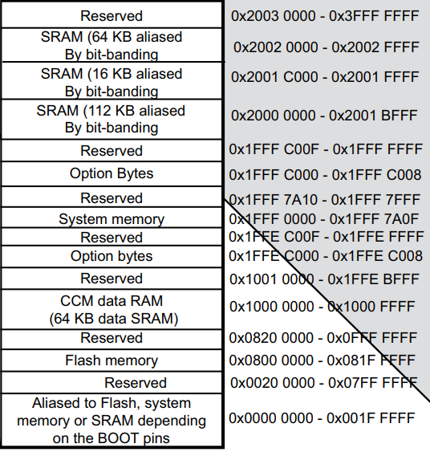
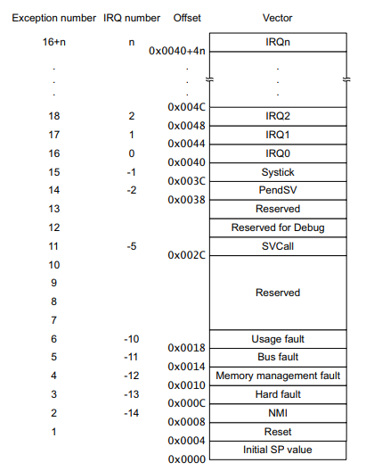

# Super Simple Bootloder for STM32

Youtube channel of the STMicroelectronics made a tutorial about bootloaders in [link](https://www.youtube.com/watch?v=OkUQ3iMmiYQ&list=PLnMKNibPkDnEb1sphpdFJ3bR9dNy7S6mO&ab_channel=STMicroelectronics),
and coded a very basic bootloader for NUCLEO-F429ZI according to it.

You can find this README file as a blog post as well in [my blog].

## Summary of the Tutorial

According to the design, there are two STM32 projects, one for the bootloader and one for the application that will be jumped from the bootloader.

## Memory Overview

We need to place the bootloader and the app in the flash memory. Lets first see the memory map of the mcu from the datasheet.

We have Flash memory (2048 KB) and RAM (256 KB) whose addresses are below.



We can allocate 32 KB in Flash for the bootloader. The rest of it can be used by the app which could be 2016 KB.

## Linker Scripts

The first thing we do is to set linker scripts to organize memory.
STM32F429ZITX_FLASH.ld is the correct script to modify.
STM32F429ZITX_RAM.ld is to make the program run on RAM only which is not the case.

This is the default memory definition for Nucleo-F429ZI.

```
/* Memories definition */
MEMORY
{
  CCMRAM    (xrw)  : ORIGIN = 0x10000000,   LENGTH = 64K
  RAM    (xrw)     : ORIGIN = 0x20000000,   LENGTH = 192K
  FLASH    (rx)    : ORIGIN = 0x8000000,   LENGTH = 2048K
}
```
Our bootloader will occupy 32 KB in 0x8000000. Therefore change the memory definition to this.

```
/* New memories definition for the bootloader */
MEMORY
{
  CCMRAM    (xrw)  : ORIGIN = 0x10000000,   LENGTH = 64K
  RAM    (xrw)     : ORIGIN = 0x20000000,   LENGTH = 192K
  FLASH    (rx)    : ORIGIN = 0x8000000,   LENGTH = 32K
}
```

The application has the following memory definition.
It will use 2048-32=2016 KB Flash memory.
The application address starts after the bootloader.
32KB = 32768 Bytes.
32768 = 0x8000
0x8000000+0x8000 = 0x8008000

```
/* New memories definition for the application */
MEMORY
{
  CCMRAM    (xrw)  : ORIGIN = 0x10000000,   LENGTH = 64K
  RAM    (xrw)     : ORIGIN = 0x20000000,   LENGTH = 192K
  FLASH    (rx)    : ORIGIN = 0x8008000,   LENGTH = 2016K
}
```

## Jumping to the App

In order to jump the app from the bootloader, we can add these codes to main.c in the bootloader project.

```
#define FLASH_APP_ADDR 0x8008000

typedef void (*pFunction)(void);
uint32_t JumpAddress;
pFunction Jump_To_Application;

void go2APP(void)
{
  // set stack pointer before jump, but is it necessary?
  // https://stackoverflow.com/questions/74864651/setting-stack-pointer-before-jumping-to-app-from-bootloader
  __set_MSP(*(uint32_t*)FLASH_APP_ADDR); // in cmsis_gcc.h 

  JumpAddress = *(uint32_t*)(FLASH_APP_ADDR + 4);
  Jump_To_Application = (pFunction) JumpAddress;
  Jump_To_Application();
}
```

Let’s examine the code above a bit. This figure shows the vector table for the cortex m.



The first place holds the address of the initial stack pointer. Actually, it points to the last address of the reserved memory of the application in RAM. In my board, it will point to 0x20030000.

The second element in the table holds the address of the Reset_Handler function. This function is autogenerated by IDE and located in startup_stm32f429zitx.c file. In my board, it points to 0x8000c31.
This function actually handles the boot process. It will write the project codes to RAM and starts the application.

In our bootloader we can jump to this function and the Reset_Handler of the jumped app can handle the rest.

## Setting Vector Table Offset in App

After modifying the linker script we need to set the vector table offset for app project.

In system_stm32f4xx.c

```
#define VECT_TAB_BASE_ADDRESS   FLASH_BASE   // 0x8000000
#define VECT_TAB_OFFSET         0x00008000U 
```

## Debug Configurations

We will be ready to deploy after setting the configuration.

- Open the debug configuration of the bootloader
- Open the startapp tab
- Add app project. (keep the default settings, set only debug/release)
  